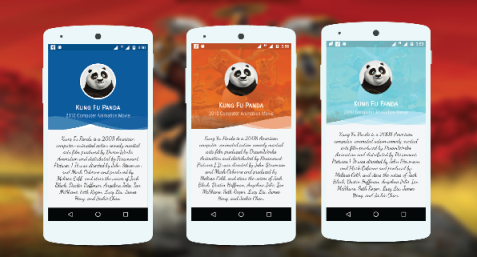

# Frisson
Provide Funky cuts on image (The Perfect Header for Profile UI) 

[](https://android-arsenal.com/api?level=9)  [](https://jitpack.io/#IntruderShanky/FunkyHeader)

[Demo App - IS Library](https://play.google.com/store/apps/details?id=com.intrusoft.islibrarydemo)

<a href='https://play.google.com/store/apps/details?id=com.intrusoft.islibrarydemo&utm_source=global_co&utm_small=prtnr&utm_content=Mar2515&utm_campaign=PartBadge&pcampaignid=MKT-Other-global-all-co-prtnr-py-PartBadge-Mar2515-1'></a>


# Usage
Step 1. Add the JitPack repository to your build file
```groovy
allprojects {
        repositories {
            ...
            maven { url "https://jitpack.io" }
        }
    }
```
Step 2. Add the dependency
```groovy
dependencies {
  compile 'com.github.IntruderShanky:Frisson:2.0.0'
 }
 ```
 
 
# Implementation
###XML Implementation:
```xml
 <com.intrusoft.library.FrissonView
        android:id="@+id/frisson_view"
        android:layout_width="match_parent"
        android:layout_height="350dp"
        frisson:alphaValue="190"
        frisson:autoTint="true"
        frisson:tideHeight="50dp"
        frisson:tintColor="#01579B" />
```
###Attributes
####Image ScaleType
```xml
frisson:scaleType="centerCrop"
frisson:scaleType="fitXY"
```
####Image Drawable Resource
```xml
frisson:src="@drawable/your_image"
```
####Background Tint Color
```xml
frisson:tintColor="@color/your_color"
```
####Alpha Value (Ranges from 0 to 255) Default Value: 50
```xml
frisson:alphaValue="value"
```
####Auto Tint (Pick automatically tint color from image)
```xml
frisson:autoTint="true"
```
####Tide Height (Height of waves)
```xml
frisson:tideHeight="50dp"
```
####Tide Count (No. of Tides)
```xml
frisson:tideCount="true"
```


###Java Implementation:
```java
FrissonView frissonView = (FrissonView) findViewById(R.id.frisson_view);

// to set image from resources        
frissonView.setImageSource(R.drawable.your_image);

// to set bitmap
frissonView.setBitmap(bitmap);

// to set the background color (color should have some alpha val)
frissonView.setColorTint(Color.GREEN);
```
#Licence
```
Copyright (c) 2016 Aakash Jain

Permission is hereby granted, free of charge, to any person obtaining a copy
of this software and associated documentation files (the "Software"), to deal
in the Software without restriction, including without limitation the rights
to use, copy, modify, merge, publish, distribute, sublicense, and/or sell
copies of the Software, and to permit persons to whom the Software is
furnished to do so, subject to the following conditions:

The above copyright notice and this permission notice shall be included in all
copies or substantial portions of the Software.

THE SOFTWARE IS PROVIDED "AS IS", WITHOUT WARRANTY OF ANY KIND, EXPRESS OR
IMPLIED, INCLUDING BUT NOT LIMITED TO THE WARRANTIES OF MERCHANTABILITY,
FITNESS FOR A PARTICULAR PURPOSE AND NONINFRINGEMENT. IN NO EVENT SHALL THE
AUTHORS OR COPYRIGHT HOLDERS BE LIABLE FOR ANY CLAIM, DAMAGES OR OTHER
LIABILITY, WHETHER IN AN ACTION OF CONTRACT, TORT OR OTHERWISE, ARISING FROM,
OUT OF OR IN CONNECTION WITH THE SOFTWARE OR THE USE OR OTHER DEALINGS IN THE
SOFTWARE.
```

